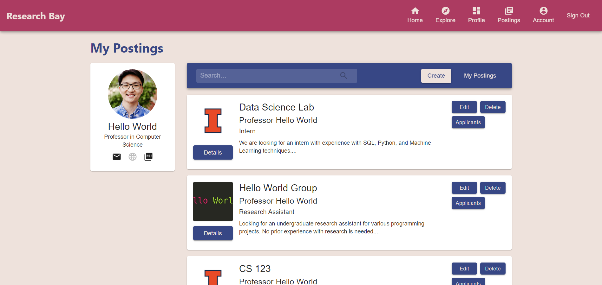
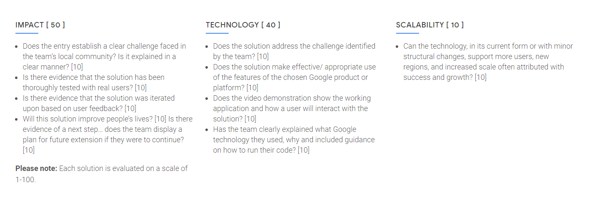
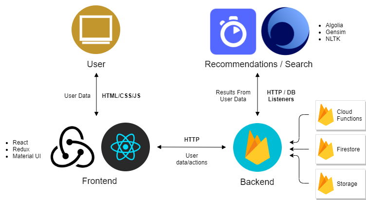
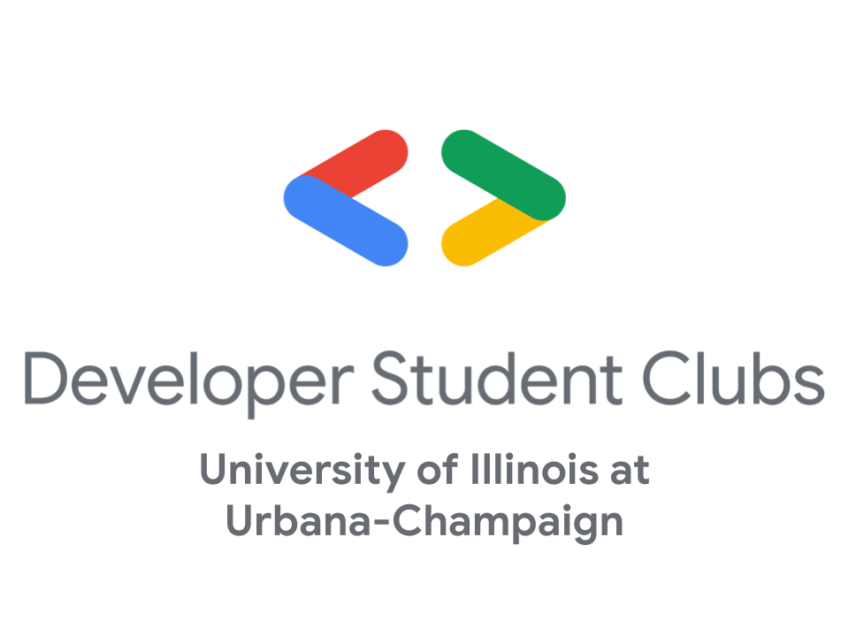

<br />
<p align="center">
  <a href="https://github.com/DSC-UIUC/research-bay">
    
  </a>

  <h3 align="center">:mag_right: Research Bay</h3>

  <p align="center">
    A web platform for efficiently connecting students to research opportunities and professors
    <br />
    <a href="https://research-bay.web.app"><strong><< Live Website >></strong></a>
    <br />
    <br />
  <strong>Code Repository Links</strong>
    <br />
    <a href="https://github.com/DSC-UIUC/research-bay">Main</a>
    ·
    <a href="https://github.com/DSC-UIUC/rbay-frontend">Frontend</a>
    ·
    <a href="https://github.com/DSC-UIUC/rbay-backend">Backend</a>
    ·
    <a href="https://github.com/DSC-UIUC/rbay-data-ml">Data/ML</a>
  </p>
</p>


## Table of Contents

* [About](#about)
  * [Background](#background)
  * [Solution](#solution)
  * [DSC Solution Challenge](#dsc-solution-challenge)
  * [Structure](#structure)
  * [Technologies](#technologies)
* [Getting Started](#getting-started)
  * [Prerequisites](#prerequisites)
  * [Setup](#setup)
* [Usage](#usage)
* [Future Roadmap](#future-roadmap)
* [Team](#team)
* [Contributing](#contributing)
* [Contact](#contact)
* [Acknowledgements](#acknowledgements)


## About

<p align="center">
  <a href="">
    
  </a>
  <br />
  <i>A screen shot of a sample professor user's "postings" page for managing their open student research positions</i>
</p>

Research Bay is a community-driven project built by students at the Developer Student Club at University of Illinois at Urbana-Champaign (UIUC) that aims to provide a streamlined and standardized platform for UIUC professors and students to easily connect with research opportunities and talent.

### Background

University of Illinois has thousands of research opportunities for students every year. However, many are unaware of what research opportunities exist. Currently, there is no standardized way of discovering or pursuing research with professors. To land a role, students must search for willing professors or hunt through physical job boards and endless department emails to find research programs and opportunities. 

This is a serious community issue because research is essential for allowing students to gain hands-on experience, form professional connections with professors, and contribute to potential advancements in the field. Likewise, professors heavily rely on student talent to advance their projects.

### Solution

Research Bay aims to provide a streamlined and standardized web platform for UIUC professors and students to easily connect with talent and research opportunities. Users are able to create personalized profiles focusing on their research interests. Professors can post research positions and be recommended best-fit students while students can search postings and be recommended research positions.  

### DSC Solution Challenge

Research Bay is a project originally created to be submitted to the Developer Student Club program's annual [Solution Challenge](https://events.withgoogle.com/dsc-solution-challenge/) for 2020. As a result, the DSC @ UIUC team consistently strived to develop the project focused on the contest's grading criteria.

<p align="center">
  <a href="https://events.withgoogle.com/dsc-solution-challenge">
    
  </a>
</p>


### Structure

<p align="center">
  
</p>

Research Bay is built as a scalable web application that uses the principles of REST and Serverless to be efficient, modular, and open to future expansion. It is separated into two main components: a React.js frontend app and a Serverless backend API powered by multiple Firebase/GCP services, such as Cloud Functions, Storage, and Firestore. The React.js website is currently deployed using Firebase Hosting and is available [here](https://research-bay.web.app). A mobile app in Flutter for Android is currently in the planning stage and would easily integrate with the existing backend.

For organized development, Research Bay's code is divided into the following three public Github repositories:

* [Frontend](https://github.com/DSC-UIUC/rbay-frontend)
* [Backend](https://github.com/DSC-UIUC/rbay-backend)
* [Data/ML](https://github.com/DSC-UIUC/rbay-data-ml) (For our recommendation and search systems)

More detailed documentation specific to each component can be found in each repository's README file.

### Technologies

The following is a non-exhaustive, general overview of the various tools that are used to develop Research Bay.

* [Firebase](https://firebase.google.com/)
* [Google Cloud Platform](https://cloud.google.com/)
* [React.js](https://reactjs.org/)
  * [create-react-app](https://github.com/facebook/create-react-app)
  * [Material UI](https://material-ui.com/)
  * [Redux](https://redux.js.org/)
* [Node.js](https://nodejs.org/en/)
* [Algolia](https://www.algolia.com/)


## Getting Started

Due to the structural nature of Research Bay, attempted changes to its internal Firebase deployment by external users will be rejected. Thus, a new Firebase and Algolia project must be created to deploy your own full instance of Research Bay (both frontend and backend). However, all of Research Bay's code is publicly accessible. Please follow the guide below to get started.

### Prerequisites

The latest versions of the following software are required:
* [git](https://git-scm.com/downloads)
* [npm](https://www.npmjs.com/get-npm)
* [Firebase CLI](https://firebase.google.com/docs/cli)

#### Creating a Firebase Project

1. Navigate to the [Firebase Console](https://console.firebase.google.com/)
2. Click "Add Project"
3. Follow the on-screen prompts. Disable Google Analytics. 
4. Once the project is created, enable and setup the following Firebase services:

    * Authentication
      * Enable only the Email/Password sign-in method without email link.
    * Database (Firestore)
      * Set to production mode.
      * Once provisioned, create the following collections (schema isn't important yet): `postings`, `profiles`, `users`
    * Storage: 
      * Once provisioned, create the following folders within the default bucket: `picture`, `resume`
    * Hostings
    * Functions
  
Instructions for better security rules for Firestore and Storage will be updated once the Research Bay team determines those that are fit for the project.

After the Firebase CLI is installed and the project has been created, do:

```sh
firebase login
```

### Setup

#### Frontend
 
```sh
git clone https://github.com/DSC-UIUC/rbay-frontend.git rbay-frontend
cd rbay-frontend
npm install
npm start
```

The React.js website should launch at `localhost:3000`. Please post any issues with setup [here](https://github.com/DSC-UIUC/rbay-frontend/issues). To deploy to Firebase Hosting, please follow detailed instructions [here](https://www.robinwieruch.de/firebase-deploy-react-js).

#### Backend

```sh
git clone https://github.com/DSC-UIUC/rbay-backend.git rbay-backend
cd rbay-backend
firebase init
```

When prompted, select to only initialize Firebase Cloud Functions. Afterwards, do:

```sh
cd functions
npm install
cd ..
firebase deploy --only functions
```

The Research Bay Cloud Functions should now be deployed. Any local changes to function code must be manually deployed to Firebase in the future. 

#### Data/ML

TODO

## Usage

Please refer to Research Bay's three repositories and their respective READMEs for additional details, documentation, and examples.

## Future Roadmap

### Release

With much of Research Bay's core features largely complete, the team has started planning for Research Bay's eventual public release to the University of Illinois population. Once all features and sufficiently refined, tested, and finalized, the team expects to begin a limited release of Research Bay to groups of selected students and professors at UIUC sometime in fall 2020 to gather more user feedback, make any necessary updates, and gradually prepare for a full release farther in the future. Ideally, Research Bay could expand to other universities to continue its mission in new regions.


### Continued Development

The Research Bay team also plans to continue development and maintenance of this project. Current plans are briefly described below, listed in order of short-term to long-term goals. Future development will continue to emphasize scalability, clean design, and better user experience.

1. UI Additions / Improvements
    * Local filtering for search and recommendation results
    * View and edit requirements for postings
    * Faster loading times for actions
    * Style / theme changes
2. Backend Code Optimizations / Speedups
    * Improve function code to reduce latency between client and server
    * Remove redundant DB queries
3. Recommendation / Search System Improvements
    * Larger, more generalized training data
    * Test with more user profiles and postings
4. Mobile app 
    * Would be a new frontend interface to expand Research Bay's availability and reach
    * Easy integration with existing backend
    * Develop in Flutter

## Team

Research Bay was originally developed by student members of Developer Student Club at UIUC in the 2019-2020 school year. All students who made a non-trivial effort and contribution to this project are below. Special thanks to all of these hard-working students! :smile:

| Student                                                                             | Role             | Team              |
|-------------------------------------------------------------------------------------|------------------|-------------------|
| [Keon (Isaac) Park](https://www.linkedin.com/in/parkkeo1/)                          | Lead Dev, Mentor | Frontend, Backend |
| [Dhvanil Popat](https://www.linkedin.com/in/dhvanilpopat/)                          | Dev              | Frontend          |
| [Rutu Brahmbhatt](https://www.linkedin.com/in/rutu-brahmbhatt/)                     | Dev              | Frontend          |
| [Alex Li](https://www.linkedin.com/in/akevli/)                                      | Dev              | Frontend          |
| [Thomas Yang](https://www.linkedin.com/in/tyang1780/)                               | Dev              | Backend           |
| [Steven Pan](https://www.linkedin.com/in/stevenxpan/)                               | Dev              | Backend           |
| [Aditya Sriram](https://www.linkedin.com/in/sriramaditya/)                          | Dev              | Backend           |
| [Neil Reddy](https://www.linkedin.com/in/neil-reddy-528275175/)                     | Dev              | Data/ML           |
| [Jonathan He](https://www.linkedin.com/in/jonathan-he-00a009193/)                   | Dev              | Data/ML           |
| [Reetahan Mukhopadhyay](https://www.linkedin.com/in/reetahan-mukhopadhyay/)         | Dev              | Data/ML           |
| [Kavi Ravuri](https://www.linkedin.com/in/kavi-ravuri/)                             | Mentor           | Backend           |

## Contributing

<p align="center">
  <br />
  
  <br />
</p>

Research Bay is developed and maintained by students in Developer Student Club at UIUC. If you are interested in contributing to this project or joining the club, please reach out to club staff at [dscuiuc2@gmail.com](mailto:dscuiuc2@gmail.com). DSC @ UIUC will resume new member recruitment in fall 2020, and more information will be posted on the DSC @ UIUC [website](bit.ly/dscuiuc).

## License

Distributed under the MIT License. See `LICENSE` for more information.

## Contact

Please feel free to email the DSC @ UIUC staff at [dscuiuc2@gmail.com](mailto:dscuiuc2@gmail.com) with any questions or concerns.

## Acknowledgements

Special thanks to:

* [Developer Student Club Program by Google Developers](https://developers.google.com/community/dsc)
* Daniel Fiorillo, DSC North America Community Manager
